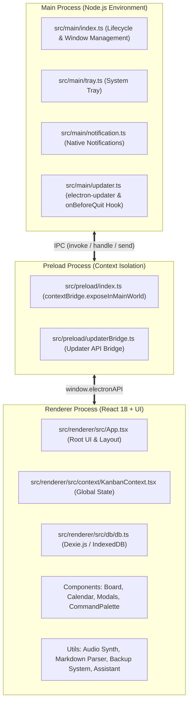
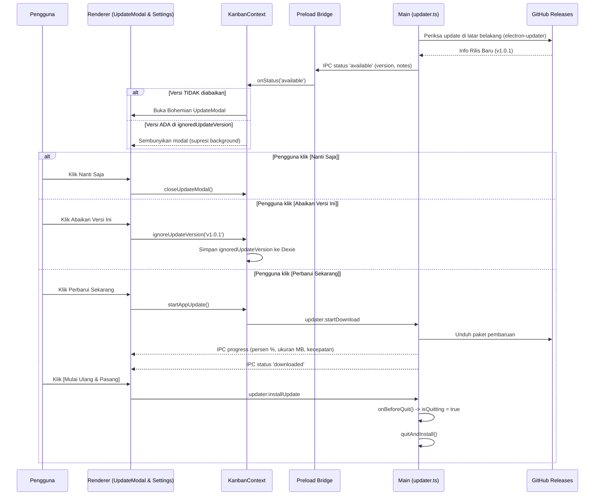

# Arsitektur Sistem (ARCHITECTURE.md)

Dokumen ini menguraikan arsitektur teknis, desain proses, aliran data, dan subsistem pada aplikasi desktop **KanbanGO!**.

---

## 1. Ikhtisar Arsitektur Tiga Tingkat (3-Tier Architecture)

KanbanGO! menerapkan arsitektur standar Electron dengan pemisahan proses yang ketat (*context isolation*) dan keamanan berbasis prinsip hak akses minimal:



---

## 2. Rincian Proses

### 2.1. Main Process (`src/main/`)
Berjalan di lingkungan Node.js dengan akses penuh ke sistem operasi.

- **`index.ts`**:
  - Mengatur siklus hidup aplikasi (`app.on('ready')`, `window-all-closed`, `before-quit`).
  - Menginisialisasi jendela utama frameless (`BrowserWindow`) dengan opsi `titleBarStyle: 'hidden'` dan ikon aplikasi resmi (`resources/icon.png`).
  - Menangani event IPC untuk kontrol jendela (`window:minimize`, `window:maximize`, `window:close`).
  - Menerapkan mekanisme **close-to-tray**: ketika pengguna mengklik tombol tutup [X], jendela disembunyikan ke System Tray kecuali jika aplikasi sedang dalam proses keluar resmi (`isQuitting = true`).
- **`tray.ts`**:
  - Mengelola ikon System Tray dengan `getAppTrayIcon()` yang memuat biner 16x16 / 32x32 dari `resources/` dengan fallback buffer base64, menu konteks baki (Buka KanbanGO!, Picu Hardcore Reminder, Keluar), dan interaksi klik baki.
- **`notification.ts`**:
  - Menangani IPC `notification:show` untuk memicu notifikasi native sistem operasi dengan ikon aplikasi.
- **`updater.ts`**:
  - Membungkus `electron-updater` dengan konfigurasi aman: `autoDownload = false` dan `autoInstallOnAppQuit = false`.
  - Dilengkapi proteksi **`onBeforeQuit` hook**: mengeset `isQuitting = true` sebelum memanggil `quitAndInstall()` agar instalasi update tidak dibatalkan oleh interceptor close-to-tray.
  - Menyediakan mock updater untuk lingkungan pengujian otomatis tanpa koneksi jaringan aktual.

### 2.2. Preload Process (`src/preload/`)
Menjembatani komunikasi yang aman antara Main Process dan Renderer Process melalui `contextBridge`.

- **`index.ts`**:
  - Mengisolasi antarmuka IPC dan mengekspos objek aman `window.electronAPI` ke jendela browser.
  - Membuka akses kontrol jendela (`minimize`, `maximize`, `close`, `isMaximized`).
- **`updaterBridge.ts`**:
  - Mengekspos API pembaruan versi: `check()`, `startDownload()`, `quitAndInstall()`, `getCurrentVersion()`, `onStatus()`, dan `onProgress()`.
- **`index.d.ts`**:
  - Definisi TypeScript lengkap untuk autocompletion dan validasi tipe ketat di lingkungan Renderer.

### 2.3. Renderer Process (`src/renderer/`)
Antarmuka pengguna grafis berbasis React 18, Vite, dan Tailwind CSS.

- **`KanbanContext.tsx`**:
  - Sumber kebenaran tunggal (*Single Source of Truth*) untuk seluruh data aplikasi.
  - Mengelola sinkronisasi data reaktif dengan IndexedDB Dexie.
  - Mengatur status updater (`updaterStatus`, `updateInfo`, `updateProgress`, `isUpdateModalOpen`).
  - Memiliki `isManualCheckRef` yang memungkinkan pemeriksaan manual di Settings mengabaikan nomor versi yang sebelumnya diabaikan pengguna.
- **`db/`**:
  - Pembungkus database lokal Dexie.js dengan skema:
    - `boards`: `id, title, isArchived, createdAt, updatedAt`
    - `columns`: `id, boardId, title, order`
    - `cards`: `id, boardId, columnId, title, priority, order, dueDate, coverColor`
    - `checklists`: `id, cardId, title, isCompleted, order`
    - `settings`: `id, theme, activeBoardId, openBoardIds, ignoredUpdateVersion, profile`

---

## 3. Subsistem Khusus

### 3.1. Audio Synthesizer Prosedural (`utils/audio.ts`)
KanbanGO! tidak memerlukan aset audio `.mp3` atau `.wav` eksternal. Semua efek suara taktil (klik tombol, pop, geser kartu, letak kartu, buka/tutup modal) disintesis secara prosedural menggunakan **Web Audio API**:
- Menggunakan osilator *sine*, *triangle*, dan pengatur *gain envelope* berbasis eksponensial.
- Ringan, bebas latensi berkas, dan tidak memperbesar ukuran installer biner.

### 3.2. Markdown Parser Mandiri (`utils/markdown.ts`)
Mengonversi teks deskripsi kartu dan catatan rilis (*release notes*) menjadi HTML aman secara mandiri menggunakan regex prosedural:
- Mendukung heading (`#`, `##`, `###`), teks tebal (`**bold**`), miring (`*italic*`), daftar poin (`- item`), blok kode (```), dan link markdown.
- Sanitasi tag berbahaya untuk mencegah serangan XSS.

### 3.3. Backup & Restore Enkapsulasi (`utils/backup.ts`)
- Mengekspor seluruh struktur board aktif, kolom-kolomnya, kartu-kartunya, checklist, dan tags ke berkas format JSON terstruktur.
- Memvalidasi integritas skema berkas impor menggunakan skema ketat dengan toleransi auto-repair untuk mencegah kerusakan IndexedDB.

### 3.4. Asisten Hardcore Produktivitas (`utils/assistantEngine.ts`)
- Mengevaluasi kartu tugas secara berkala berdasarkan tenggat waktu (*due date*) dan status penyelesaian.
- Menghasilkan pesan briefing harian yang adaptif serta dorongan motivasi sesuai profil persona pengguna.

### 3.5. Alur Auto-Updater Opsional


---

## 4. Desain Keamanan & Privasi

1. **Prinsip Nol Pelacak Cloud (Offline-First):** Seluruh data papan kerja, kartu, dan profil disimpan di IndexedDB lokal perangkat pengguna. Tidak ada data pribadi atau tugas yang dikirim ke server pihak ketiga.
2. **Context Isolation & Sandbox:** Renderer Process berjalan dalam mode terisolasi tanpa akses langsung ke modul Node.js sistem (`nodeIntegration: false`, `contextIsolation: true`).
3. **Pemberitahuan Transparan Pembaruan:** Pembaruan aplikasi tidak pernah diunduh atau dipasang secara diam-diam tanpa persetujuan eksplisit dari pengguna.
