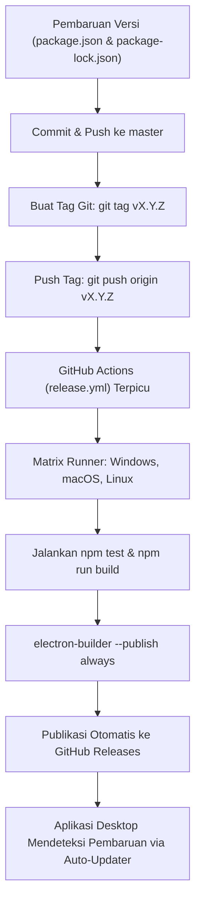

# Panduan Alur Kerja & Rilis (Workflow)

Dokumen ini menjelaskan alur kerja pengembangan, standar pengujian, konvensi commit, dan prosedur rilis aplikasi **KanbanGO!**.

---

## 1. Strategi Percabangan Git (Branching Strategy)

Proyek ini menggunakan model percabangan berbasis fitur yang bersih:

- **`master` / `main`**: Branch produksi utama. Setiap commit di branch ini harus selalu dalam kondisi stabil, semua tes lolos (100%), dan siap dibuild.
- **`feat/<nama-fitur>`**: Branch untuk pengembangan fitur baru (contoh: `feat/multi-board-tabs`, `feat/calendar-view`).
- **`fix/<nama-perbaikan>`**: Branch untuk perbaikan bug spesifik (contoh: `fix/linux-maintainer-email`).
- **`chore/<tugas>`**: Branch untuk pembaruan dependensi, konfigurasi CI/CD, atau dokumentasi.

### Alur Kerja Fitur:
1. Buat branch baru dari `master`:
   ```bash
   git checkout master
   git pull origin master
   git checkout -b feat/nama-fitur
   ```
2. Kembangkan kode secara modular dengan pengujian terpadu (*Test-Driven / Verified*).
3. Jalankan seluruh rangkaian tes:
   ```bash
   npm test
   ```
4. Pastikan build produksi berhasil tanpa error:
   ```bash
   npm run build
   ```
5. Merge branch ke `master` secara bersih (fast-forward atau merge commit), lalu hapus branch lokal.

---

## 2. Standar Pengujian & Kualitas Kode

Sebelum melakukan commit atau rilis, setiap pengembang wajib memvalidasi:

1. **Unit & Integration Tests:**
   - Semua berkas pengujian berada di folder `tests/`.
   - Menggunakan **Vitest** dan `@testing-library/react`.
   - Perintah pengujian:
     ```bash
     npm test                      # Menjalankan seluruh 201+ tes
     npx vitest run tests/xyz.test # Menjalankan tes spesifik
     ```
2. **Build Validation:**
   - Menjalankan `electron-vite build` untuk memastikan bundel `main`, `preload`, dan `renderer` tidak mengalami error modul atau tipe TypeScript:
     ```bash
     npm run build
     ```
3. **Dokumentasi Terpadu:**
   - Pastikan dokumentasi inti (`README.md`, `CHANGELOG.md`, `ARCHITECTURE.md`) diperbarui jika ada perubahan antarmuka atau perilaku sistem.

---

## 3. Konvensi Commit Git

Komitmen kode wajib mengikuti konvensi **Conventional Commits**:

```text
<type>(<scope>): <deskripsi singkat dalam bahasa Inggris atau Indonesia>
```

### Jenis Tipe Commit:
- `feat`: Penambahan fitur baru bagi pengguna.
- `fix`: Perbaikan bug atau kegagalan sistem.
- `refactor`: Perubahan struktur kode tanpa mengubah fungsionalitas.
- `test`: Penambahan atau penyesuaian berkas pengujian.
- `docs`: Pembaruan dokumentasi.
- `chore`: Penyesuaian konfigurasi build, dependensi, atau skrip pembantu.

> [!IMPORTANT]
> **Aturan Mutlak Tanpa Atribusi AI:**  
> Dilarang menambahkan trailer atribusi AI apa pun (seperti `Co-Authored-By: Claude...`, `Generated with...`) pada pesan commit, deskripsi pull request, maupun komentar kode. Semua komitmen dicatat atas nama pemilik repositori/pengembang manusia saja.

---

## 4. Alur Rilis Produksi & Distribusi (Release Process)

Alur rilis sepenuhnya otomatis memanfaatkan GitHub Actions dan `electron-builder`:



### Langkah demi Langkah Merilis Versi Baru:

1. **Tentukan Versi Baru (SemVer):**
   - Perbarui field `"version"` di [`package.json`](file:///D:/Occupation/Porto/Project-LLM/Web-test/KanbanGo2/package.json) dan `package-lock.json`:
     ```json
     "version": "1.0.2"
     ```
2. **Catat Perubahan di [`CHANGELOG.md`](file:///D:/Occupation/Porto/Project-LLM/Web-test/KanbanGo2/CHANGELOG.md):**
   - Tambahkan entri baru di bawah bagian versi baru tersebut.
3. **Commit & Push ke `master`:**
   ```bash
   git add package.json package-lock.json CHANGELOG.md
   git commit -m "chore(release): bump version to 1.0.2"
   git push origin master
   ```
4. **Buat & Dorong Tag Versi:**
   ```bash
   git tag v1.0.2
   git push origin v1.0.2
   ```
5. **Pantau Alur Kerja CI/CD:**
   - Buka tab **Actions** di repositori GitHub.
   - Ketiga job (Windows, macOS, Linux) akan menguji, membangun biner, dan mengunggah artefak ke **GitHub Releases**.
6. **Verifikasi Ketersediaan Rilis:**
   - Periksa halaman `https://github.com/LyKhan77/KanbanGO-app-byLee/releases`.
   - Pastikan berkas `.exe`, `.dmg`, `.zip`, `.AppImage`, `.deb`, serta metadata `.yml` telah tersedia.
